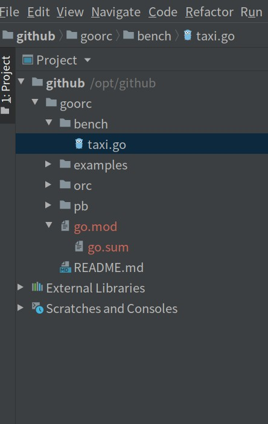
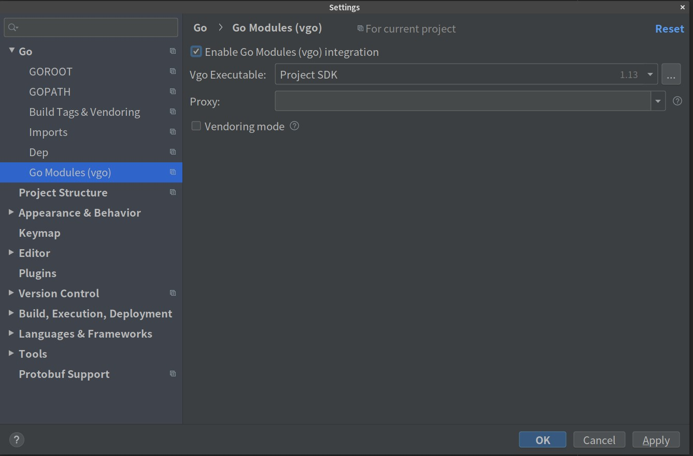

# Convert project without dependency manager
```console
git clone https://github.com/PatrickHuang888/goorc.git
cd goorc
go mod init github.com/patrickhuang888/goorc
export http_proxy=localhost:7777
go mod tidy
```
go mod tidy added module requirements for all the packages transitively imported by packages in your module and built a go.sum with checksums for each library at a specific version. 

# Goland setting




# Reference
[Migrating to Go Modules](https://blog.golang.org/migrating-to-go-modules)  
[A QUICK INTRODUCTION TO GO MODULES](https://smalldata.tech/blog/2019/03/16/a-quick-introduction-to-golang-modules)